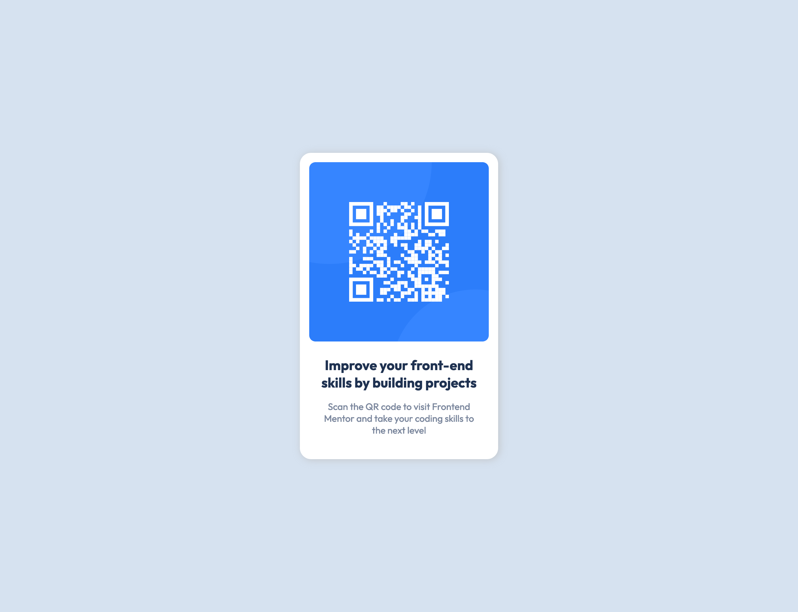

# Frontend Mentor - QR code component solution

This is a solution to the [QR code component challenge on Frontend Mentor](https://www.frontendmentor.io/challenges/qr-code-component-iux_sIO_H). Frontend Mentor challenges help you improve your coding skills by building realistic projects. 

## Table of contents

- [Overview](#overview)
  - [Screenshot](#screenshot)
  - [Links](#links)
- [My process](#my-process)
  - [Built with](#built-with)
  - [What I learned](#what-i-learned)
- [Author](#author)
- [Acknowledgments](#acknowledgments)

## Overview

### Screenshot



### Links

- Solution URL: [https://github.com/hkparkjs/qr-code-component](https://github.com/hkparkjs/qr-code-component)
- Live Site URL: [https://myqrcode-component.netlify.app/](https://myqrcode-component.netlify.app/)

## My process

### Built with

- Semantic HTML5 markup
- Flexbox

### What I learned

- how to apply web accessibility
  - Page must contain a level one heading
  - Page must have one main landmark (ARIA role attribute)
```html
<div role="main" class="qr-code-card">
  
  <h1 class="title">
    Improve your front-end skills by building projects
  </h1>
  <p class="description">
    Scan the QR code to visit Frontend Mentor and take your coding skills to the next level
  </p>
</div>
```
- how to take contents to center using flexbox
```css
body {
  margin: 0;
  width: 100%;
  min-height: 100vh;
  display: flex;
  flex-direction: column;
  justify-content: center;
  align-items: center;
  (...)
}
```

## Author

- Frontend Mentor - [@hkparkjs](https://www.frontendmentor.io/profile/hkparkjs)
